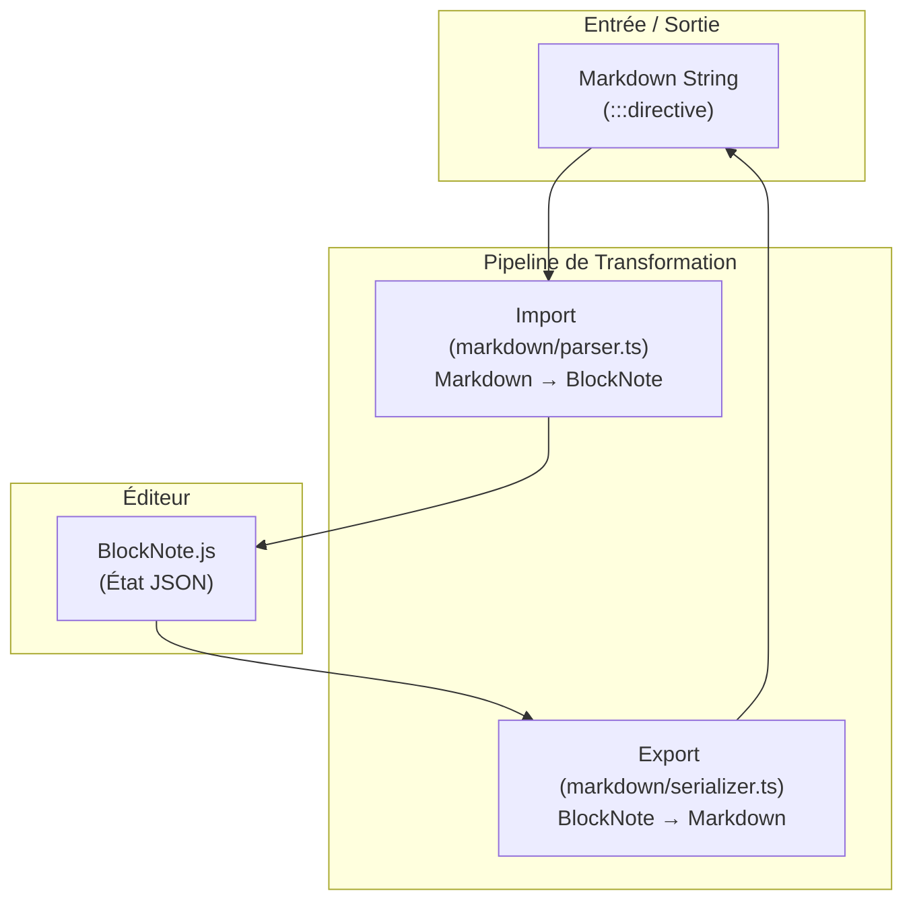

# Pipeline de Contenu Markdown

## Vue d'Ensemble

Le Content Playground utilise une architecture de contenu basée sur des **Directives Markdown** pour stocker et éditer des blocs enrichis tout en restant compatible avec le standard Markdown.


Ce document décrit :
1.  La pipeline technique d'import/export (Playground Architecture)
2.  Le format de stockage (Markdown et Directives)
3.  La création de nouveaux blocs

---

## 1. Architecture Technique (Playground)

La conversion entre le format de stockage (Markdown + Directive) et le format d'édition (BlockNote JSON) se fait via une pipeline en 5 étapes.



### Fichiers Clés

| Étape | Fichier | Rôle |
|-------|---------|------|
| **Import** | `src/lib/markdown/parser.ts` | Transforme le Markdown brut en blocs BlockNote. Gère le parsing Remark, l'AST et la conversion des directives en blocs typés. |
| **Schema** | `custom-schema.ts` | Définit les types de blocs supportés (`important`, `goodToKnow`, `toggleListItem` natif). |
| **Export** | `src/lib/markdown/serializer.ts` | Transforme les blocs BlockNote en Markdown + Directives. |

### Détail des Étapes

#### Pipeline d'Import ( `markdown/parser.ts` )
1.  **Frontmatter Stripping** : Nettoyage des métadonnées YAML.
2.  **Unified Parsing** : Utilisation de `remark-parse` + `remark-directive` pour créer l'AST.
3.  **Node Conversion** (`nodeToBlock`) : Transformation des nœuds AST (paragraphes, listes, directives) en `PartialBlock` BlockNote.
    *   *Spécificité* : Le contenu texte est traité récursivement (`serializeInline`) pour préserver le gras, l'italique et les liens imbriqués.
4.  **Inline Serialization** : Conversion du texte riche.

#### Pipeline d'Export ( `markdown/serializer.ts` )
5.  **Block Dispatcher** (`blockToMarkdown`) : Route chaque bloc vers son sérialiseur.
    *   `serializeToggle` : Convertit le bloc `toggleListItem` en syntaxe `:::toggle`.
    *   `serializeContainerBlock` : Convertit `important` et `goodToKnow` en `:::nom-directive`.
    *   Supporte aussi les tables, images, et listes à puces/numérotées/checklists.

---

## 2. Format de Stockage (Directives)

Le système utilise du Markdown standard enrichi de **Directives** pour gérer les composants complexes tout en restant lisible.

### Blocs Supportés

#### 2.1 Toggle (Accordéon)
Stocké sous forme de directive `:::toggle`. Converti nativement en `toggleListItem` dans l'éditeur.
```markdown
:::toggle{title="Titre visible"}
Contenu caché par défaut.
- Peut contenir des listes
- Et du texte enrichi
:::
```

#### 2.2 Important
Bloc de mise en évidence standard.
```markdown
:::important
**Attention** : Ceci est une information cruciale.
:::
```

#### 2.3 Bon à savoir (Good To Know)
Bloc d'information contextuelle.
```markdown
:::good-to-know
Le saviez-vous ? Cette démarche est gratuite.
:::
```

---

## 3. Ajout d'un Nouveau Bloc

Pour ajouter un nouveau type de bloc (ex: `:::citation`) :

1.  **Définir le Schema** : Créer le composant React et l'ajouter à `custom-schema.ts`.
2.  **Mettre à jour l'Import (`markdown/parser.ts`)** :
    *   Ajouter le cas dans `parseDirective()`.
    *   Mapper `:::citation` vers le type de bloc BlockNote correspondant.
3.  **Mettre à jour l'Export (`markdown/serializer.ts`)** :
    *   Ajouter le cas dans `blockToMarkdown()`.
    *   Créer une fonction `serializeCitation()` si le format est spécifique.
