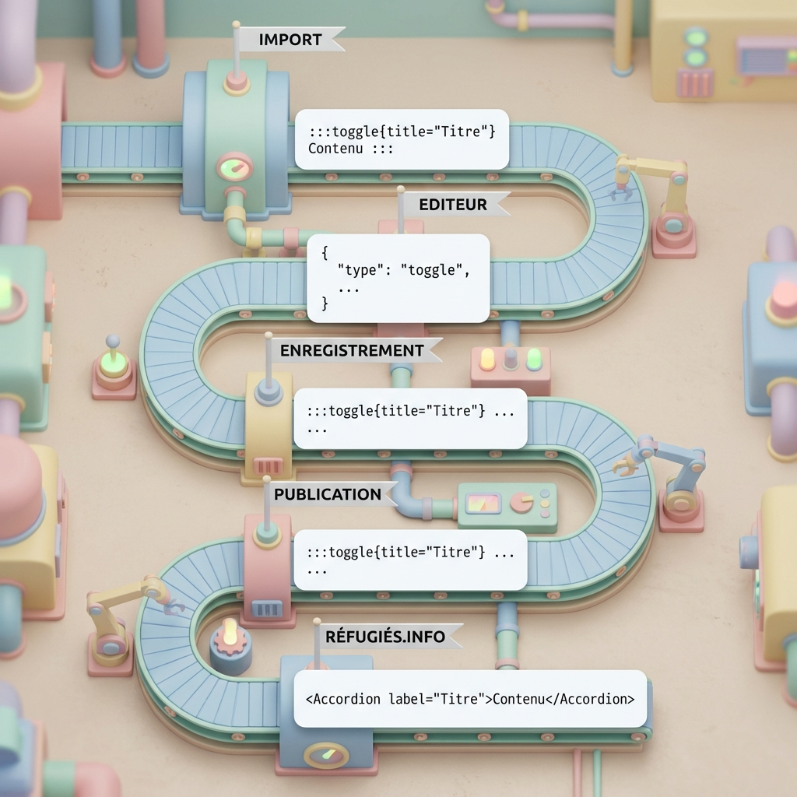
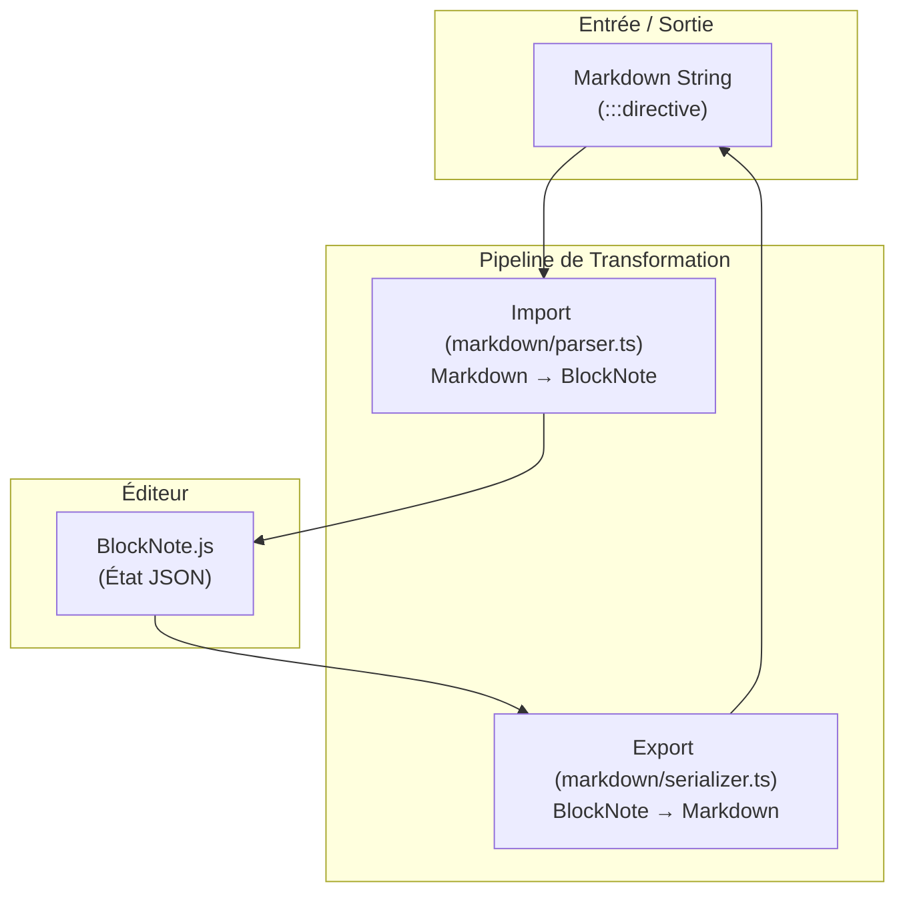
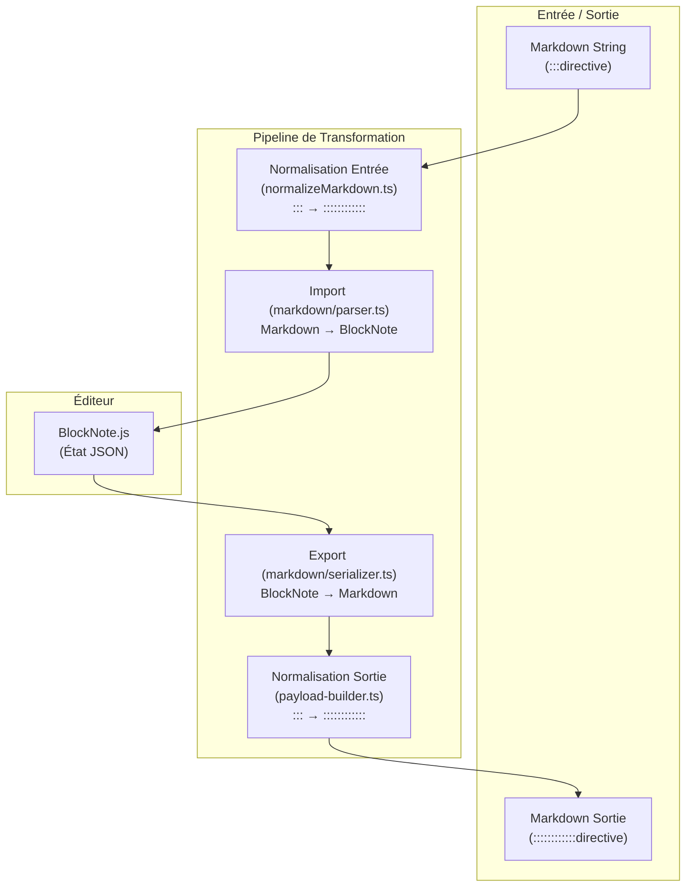

# Pipeline de Contenu Markdown

## Vue d'Ensemble

Le Content Playground utilise une architecture de contenu basée sur des **Directives Markdown** pour stocker et éditer des blocs enrichis tout en restant compatible avec le standard Markdown.



Ce document décrit :
1.  La pipeline technique d'import/export (Playground Architecture)
2.  Le format de stockage (Markdown et Directives)
3.  La création de nouveaux blocs

---

## 1. Architecture Technique (Playground)

La conversion entre le format de stockage (Markdown + Directive) et le format d'édition (BlockNote JSON) se fait via une pipeline en 5 étapes.



### Fichiers Clés

| Étape | Fichier | Rôle |
|-------|---------|------|
| **Import** | `src/lib/markdown/parser.ts` | Transforme le Markdown brut en blocs BlockNote. Gère le parsing Remark, l'AST et la conversion des directives en blocs typés. |
| **Schema** | `custom-schema.ts` | Définit les types de blocs supportés (`important`, `goodToKnow`, `toggleListItem` natif). |
| **Export** | `src/lib/markdown/serializer.ts` | Transforme les blocs BlockNote en Markdown + Directives. |

### Détail des Étapes

#### Pipeline d'Import ( `markdown/parser.ts` )
1.  **Frontmatter Stripping** : Nettoyage des métadonnées YAML.
2.  **Unified Parsing** : Utilisation de `remark-parse` + `remark-directive` pour créer l'AST.
3.  **Node Conversion** (`nodeToBlock`) : Transformation des nœuds AST (paragraphes, listes, directives) en `PartialBlock` BlockNote.
    *   *Spécificité* : Le contenu texte est traité récursivement (`serializeInline`) pour préserver le gras, l'italique et les liens imbriqués.
4.  **Inline Serialization** : Conversion du texte riche.

#### Pipeline d'Export ( `markdown/serializer.ts` )
5.  **Block Dispatcher** (`blockToMarkdown`) : Route chaque bloc vers son sérialiseur.
    *   `serializeToggle` : Convertit le bloc `toggleListItem` en syntaxe `:::toggle`.
    *   `serializeContainerBlock` : Convertit `important` et `goodToKnow` en `:::nom-directive`.
    *   Supporte aussi les tables, images, et listes à puces/numérotées/checklists.

---

## 2. Normalisation des Directives (Nesting Strategy)

### Le Problème : Parsing Ambigu des Fences

Le plugin `remark-directive` repose sur l'**indentation** pour détecter l'imbrication. Or, notre éditeur WYSIWYG (BlockNote) produit du Markdown **à plat** (sans indentation) pour simplifier la gestion des états pendant l'édition en temps réel.

**Exemple problématique (structure plate) :**
```markdown
:::toggle (Root)
:::important (Child)
::: (Ferme lequel ? Ambigu !)
::: (Ferme le Root ?)
```

Sans indication de profondeur, le parser ne sait pas quelle fence de fermeture correspond à quel bloc d'ouverture.

### La Solution : Normalisation par Longueur Décroissante

Avant le parsing, nous pré-traitons le Markdown pour attribuer des **longueurs de fence uniques** selon la profondeur d'imbrication :

| Niveau | Longueur | Exemple |
|--------|----------|---------|
| Root (niveau 0) | 12 colons | `::::::::::::toggle` |
| Niveau 1 | 11 colons | `:::::::::::important` |
| Niveau 2 | 10 colons | `::::::::::tip` |
| ... | ... | ... |
| Niveau 9 | 3 colons | `:::note` |

**Pourquoi ça fonctionne ?**

La spec CommonMark stipule qu'une fence de fermeture doit être **au moins aussi longue** que la fence d'ouverture pour fermer un bloc. En rendant les fences intérieures **plus courtes** que les fences extérieures, une fence de fermeture intérieure ne peut **jamais** fermer un bloc extérieur.

**Exemple corrigé :**
```markdown
::::::::::::toggle    (Length 12 - Root)
:::::::::::important  (Length 11 - Child)
Contenu...
::::::::::            (Length 10 - ferme Tip si présent, trop court pour Important/Root)
:::::::::::           (Length 11 - ferme Important)
::::::::::::          (Length 12 - ferme Root)
```

### Intégration dans la Pipeline



### Normalisation en Sortie (Publication / Preview)

Le markdown envoyé à la Main App (refugies.info) via preview ou publication est **également normalisé** pour éviter les problèmes de parsing côté récepteur.

**Pourquoi ?**
- La Main App utilise probablement aussi `remark-directive` pour parser le contenu
- Sans normalisation, les directives imbriquées avec des fences `:::` standard seraient ambiguës
- La normalisation garantit que le contenu reçu peut être parsé correctement

**Où ça se passe ?**
- Fichier : `src/lib/payload-builder.ts`
- Fonction : `buildDispositifPayload()`
- Appel : `normalizeMarkdown(doc.editorialContent)` avant d'inclure le markdown dans le payload

**Exemple de flux :**
```typescript
// Dans l'éditeur (stockage)
editorialContent = ":::toggle\n:::important\nContenu\n:::\n:::"

// Pour la preview/publication (payload-builder.ts)
const normalizedMarkdown = normalizeMarkdown(editorialContent);
// → "::::::::::::toggle\n:::::::::::important\nContenu\n::::::::::\n::::::::::::"

// Envoyé à la Main App dans le payload
{
  dispositif: {
    translations: {
      fr: {
        content: {
          markdown: normalizedMarkdown  // ← Normalisé !
        }
      }
    }
  }
}
```

### Fichier Clé

| Fichier | Rôle |
|---------|------|
| `src/lib/markdown/normalizeMarkdown.ts` | Pré-processeur qui réécrit les fences `:::` en longueurs décroissantes selon la profondeur d'imbrication. Gère aussi les blocs de code (ignorés pendant la normalisation). |

### Robustesse

La stratégie adopte une approche **"best effort"** :
- **Fences déséquilibrées** (fermeture sans ouverture) : Laissées telles quelles
- **Fences non fermées** à la fin du document : Ignorées (le parser gère gracieusement)
- **Blocs de code** (```) : Contenu préservé, pas de normalisation à l'intérieur

---

## 3. Format de Stockage (Directives)

Le système utilise du Markdown standard enrichi de **Directives** pour gérer les composants complexes tout en restant lisible.

### Blocs Supportés

#### 2.1 Toggle (Accordéon)
Stocké sous forme de directive `:::toggle`. Converti nativement en `toggleListItem` dans l'éditeur.
```markdown
:::toggle{title="Titre visible"}
Contenu caché par défaut.
- Peut contenir des listes
- Et du texte enrichi
:::
```

#### 2.2 Important
Bloc de mise en évidence standard.
```markdown
:::important
**Attention** : Ceci est une information cruciale.
:::
```

#### 2.3 Bon à savoir (Good To Know)
Bloc d'information contextuelle.
```markdown
:::good-to-know
Le saviez-vous ? Cette démarche est gratuite.
:::
```

---

## 4. Ajout d'un Nouveau Bloc

Pour ajouter un nouveau type de bloc (ex: `:::citation`) :

1.  **Définir le Schema** : Créer le composant React et l'ajouter à `custom-schema.ts`.
2.  **Mettre à jour l'Import (`markdown/parser.ts`)** :
    *   Ajouter le cas dans `parseDirective()`.
    *   Mapper `:::citation` vers le type de bloc BlockNote correspondant.
3.  **Mettre à jour l'Export (`markdown/serializer.ts`)** :
    *   Ajouter le cas dans `blockToMarkdown()`.
    *   Créer une fonction `serializeCitation()` si le format est spécifique.
