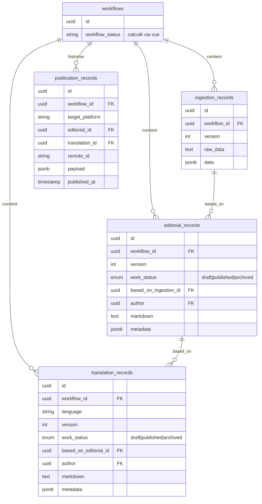
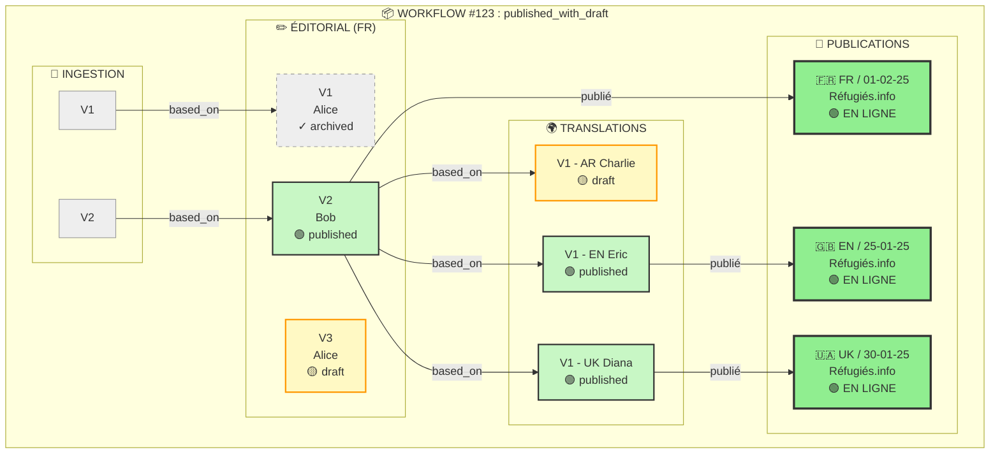
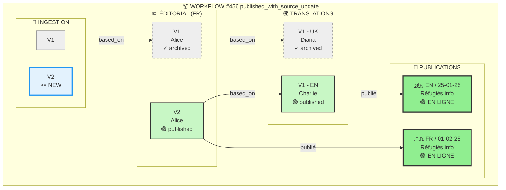
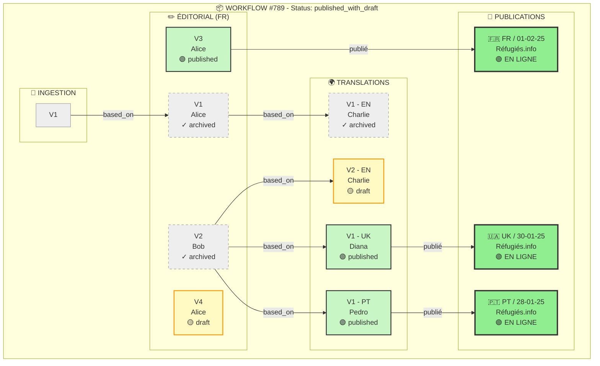

# Stratégie de Versioning - Content Playground

> Document de référence pour l'architecture de versioning du contenu
> Date : Février 2026
> Auteurs : Jérémie, Luis, Agent
> Destinataires : Équipe produit

---

## 🎯 Vue d'ensemble (pour Julie)

### Le problème qu'on résout

Aujourd'hui, quand un contenu est publié, il est figé. Si l'éditeur ou traducteur veut le modifier, il doit écraser la version précédente sans historique. Si la source (RCO/DI) se met à jour, on ne sait pas quoi faire.

**Demain**, chaque contenu aura un historique complet :
- v1 → v2 → v3 pour le français
- Chaque traduction basée sur une version spécifique du FR
- Possibilité de revenir en arrière, comparer, republier

### Les 6 états d'un workflow

| État | Ce que voit l'éditeur | Action attendue |
|------|----------------------|-----------------|
| **to_process** | "Nouveau contenu à traiter" | Commencer la rédaction |
| **draft** | "Brouillon en cours" | Continuer à rédiger |
| **draft_with_source_update** | "⚠️ Votre brouillon ne correspond plus à la source" | Choisir : continuer ou repartir de la nouvelle source |
| **published** | "Publié - En ligne" | Aucune action (ou créer nouvelle version) |
| **published_with_draft** | "🟢 Publié + 📝 Nouveau brouillon en cours" | Travailler sur la nouvelle version |
| **published_with_source_update** | "🟢 Publié ⚠️ Nouvelle source disponible" | Mettre à jour depuis la nouvelle source |

---

## 🏗️ Architecture technique

### Schéma des tables



### Nomenclature des statuts

| Niveau | Nom | Valeurs | Description |
|--------|-----|---------|-------------|
| **Workflow** | `workflow_status` | `to_process` \| `draft` \| `draft_with_source_update` \| `published` \| `published_with_draft` \| `published_with_source_update` | État global calculé (vue SQL) |
| **Record** | `work_status` | `draft` \| `published` \| `archived` | État local de chaque version |

---

## 🔗 Schémas de traçabilité (3 scénarios)

### Scénario 1 : Workflow avec brouillon en cours (`published_with_draft`)



**🎯 Story :** FR v2 est publié, mais Alice travaille déjà sur v3 (brouillon). Les traductions EN et UK sont basées sur FR v2 et publiées. AR est encore en brouillon.

---

### Scénario 2 : Source mise à jour (`published_with_source_update`)



**⚠️ Story :** Une nouvelle ingestion V2 est arrivée ! FR et EN sont publiés (basés sur V1), mais UK est archivée. L'éditeur doit décider : créer FR v3 depuis la nouvelle source ou ignorer ?

---

### Scénario 3 : Traductions désynchronisées (`published_with_draft`)



**🔥 Story complexe :** 
- FR est en v3 (publié) + v4 (brouillon)
- EN v1 est archivée, EN v2 est en brouillon (basée sur FR v2 !)
- UK et PT sont publiées mais basées sur FR v2 (pas la dernière !)
- **Problème :** Les traductions ne sont pas alignées sur la même version FR !


## 📊 Cas d'usage détaillés

### Cas 1 : Workflow linéaire simple

```
Timeline:
│
├─ T0: [RCO v1] reçu
│      workflow_status: to_process
│
├─ T1: [Ingestion v1] créée (parsée depuis RCO)
│      workflow_status: to_process
│
├─ T2: [Editorial v1: draft] créé
│      based_on_ingestion_id: ingestion_v1
│      work_status: draft
│      workflow_status: draft
│
└─ T3: [Editorial v1: published]
      work_status: published
      workflow_status: published
      └── Publication vers RI ✅
```

### Cas 2 : Mise à jour source pendant brouillon

```
Timeline:
│
├─ T0: [Ingestion v1] créée (source RCO v1)
│
├─ T1: [Editorial v2: draft] créé
│      based_on_ingestion_id: ingestion_v1
│      work_status: draft
│      workflow_status: draft
│
├─ T2: ⚠️ NOUVELLE SOURCE
│      [RCO v2] reçu
│      [Ingestion v2] créée
│      
│      🔴 CONFLIT DÉTECTÉ :
│      - Editorial v2 basé sur Ingestion v1 (ANCIENNE)
│      - Ingestion v2 disponible (NOUVELLE)
│      
│      workflow_status: draft_with_source_update
│
├─ T3: 🔀 L'éditeur CHOISIT
│
│   Option A: [Continuer v2]
│   → Ignorer Ingestion v2
│   → workflow_status: draft (retour)
│   ⚠️ Warning persiste en UI
│
│   OU
│
│   Option B: [Créer v3 depuis nouvelle source]
│   
│   └─ T3b: [Editorial v3: draft] créé
│          version: 3
│          work_status: draft
│          based_on_ingestion_id: ingestion_v2 ← NOUVELLE
│          author: (moi, l'éditeur actuel)
│          workflow_status: draft
```

### Cas 3 : Publié avec brouillon en cours (cas le plus courant)

```
[Editorial v2: published] ← En ligne sur RI
      │
      └── [Editorial v3: draft] ← Nouveau brouillon en cours
            │
            └── workflow_status: published_with_draft

UI:
┌─────────────────────────────────────────┐
│ 🟢 Publié (v2) - En ligne              │
│ 📝 Brouillon v3 en cours               │
│                                         │
│ [Continuer le brouillon] [Voir publié] │
└─────────────────────────────────────────┘
```

### Cas 4 : Traductions asynchrones

```
[FR Editorial v6: published]
      │
      ├──→ [EN Translation v1: published] (basé sur FR v6)
      │
      ├──→ [UK Translation v1: draft] (basé sur FR v6)
      │         └── Traductrice ukrainienne n'a pas fini
      │
      └──→ [PT Translation v1: published] (basé sur FR v6)
      
[FR Editorial v7: published] (mise à jour FR)
      │
      ├──→ [EN Translation v2: draft] (basé sur FR v7)
      │         └── Traducteur anglais reprend
      │
      └── [UK Translation v1] reste sur FR v6
                └── Notification "⚠️ FR mis à jour" visible
```

### Cas 5 : Publié avec mise à jour source

```
Timeline:
T0: [Editorial v2: published] ← En ligne sur RI
    │
    └── workflow_status: published
    │
T1: [Ingestion v3] arrive (source mise à jour)
    │
    └── workflow_status: published_with_source_update
    │
    └── UI: 
        "🟢 Version publiée (v2) en ligne"
        "⚠️ Nouvelle source disponible (ingestion v3)"
        [Créer un brouillon v3 depuis la nouvelle source]
```

---

## 🔧 Implémentation technique

### Migration schema

```sql
-- editorial_records: ajouter version, work_status et author
ALTER TABLE editorial_records 
ADD COLUMN version INTEGER DEFAULT 1,
ADD COLUMN work_status TEXT CHECK (work_status IN ('draft', 'published', 'archived')) DEFAULT 'draft',
ADD COLUMN based_on_ingestion_id UUID REFERENCES ingestion_records(id),
ADD COLUMN author UUID NOT NULL REFERENCES auth.users(id);

-- translation_records: même chose + language et author
ALTER TABLE translation_records 
ADD COLUMN version INTEGER DEFAULT 1,
ADD COLUMN work_status TEXT CHECK (work_status IN ('draft', 'published', 'archived')) DEFAULT 'draft',
ADD COLUMN based_on_editorial_id UUID REFERENCES editorial_records(id),
ADD COLUMN language TEXT NOT NULL DEFAULT 'fr',
ADD COLUMN author UUID NOT NULL REFERENCES auth.users(id);

-- Vue pour calculer workflow_status
CREATE OR REPLACE VIEW workflow_status_view AS
SELECT 
    w.id as workflow_id,
    w.rco_record_id,
    w.ingestion_record_id,
    
    -- Détection présence draft
    (SELECT id FROM editorial_records 
     WHERE workflow_id = w.id AND work_status = 'draft' 
     ORDER BY version DESC LIMIT 1) as current_draft_id,
    
    -- Détection présence published
    (SELECT id FROM editorial_records 
     WHERE workflow_id = w.id AND work_status = 'published' 
     ORDER BY version DESC LIMIT 1) as last_published_id,
    
    -- Calcul du status
    CASE
        WHEN NOT EXISTS (
            SELECT 1 FROM editorial_records er 
            WHERE er.workflow_id = w.id
        ) THEN 'to_process'
        
        WHEN EXISTS (
            SELECT 1 FROM editorial_records er 
            WHERE er.workflow_id = w.id AND er.work_status = 'draft'
        ) AND EXISTS (
            SELECT 1 FROM editorial_records er2 
            WHERE er2.workflow_id = w.id AND er2.work_status = 'published'
        ) THEN 'published_with_draft'
        
        WHEN EXISTS (
            SELECT 1 FROM editorial_records er 
            WHERE er.workflow_id = w.id AND er.work_status = 'published'
        ) AND (
            -- Vérifier si nouvelle ingestion disponible
            SELECT COALESCE(MAX(ir.version), 0) FROM ingestion_records ir 
            WHERE ir.workflow_id = w.id
        ) > (
            SELECT COALESCE(ir2.version, 0) FROM ingestion_records ir2
            JOIN editorial_records er ON er.based_on_ingestion_id = ir2.id
            WHERE er.workflow_id = w.id AND er.work_status = 'published'
            ORDER BY er.version DESC LIMIT 1
        ) THEN 'published_with_source_update'
        
        WHEN EXISTS (
            SELECT 1 FROM editorial_records er 
            WHERE er.workflow_id = w.id AND er.work_status = 'published'
        ) THEN 'published'
        
        WHEN EXISTS (
            SELECT 1 FROM editorial_records er 
            WHERE er.workflow_id = w.id AND er.work_status = 'draft'
        ) THEN 'draft'
        
        ELSE 'to_process'
    END as workflow_status

FROM workflows w;
```

### Transitions de work_status

| De | Vers | Quand ? |
|----|------|---------|
| draft | published | Quand on clique "Publier" |
| published | archived | Quand on publie une nouvelle version (v2 → v3) |
| draft | archived | Si on abandonne le brouillon (optionnel) |

### Tableau récapitulatif des états

| État | Publié ? | Brouillon ? | Source update ? | Action UI |
|------|----------|-------------|-----------------|-----------|
| `to_process` | ❌ | ❌ | ❌ | "Commencer" |
| `draft` | ❌ | ✅ | ❌ | "Continuer brouillon" |
| `draft_with_source_update` | ❌ | ✅ | ✅ | "Continuer" ou "Repartir de nouvelle source" |
| `published` | ✅ | ❌ | ❌ | "Voir publié" + "Nouvelle version" |
| `published_with_draft` | ✅ | ✅ | ❌ | "Continuer brouillon" + "Voir publié" |
| `published_with_source_update` | ✅ | ❌ | ✅ | "🟢 Publié ⚠️ Source update - Créer brouillon" |

---

## ✅ Checklist validation

**Pour Julie** :
- [ ] Les 6 états couvrent tous les cas métier ?
- [ ] L'UX "draft_with_source_update" est claire ?
- [ ] L'UX "published_with_source_update" est claire ?
- [ ] La gestion des traductions asynchrones répond au besoin ?

**Pour Luis** :
- [ ] Le schéma SQL est acceptable ?
- [ ] Les perfs de la vue PostgreSQL sont OK ?
- [ ] Pas de régression sur les workflows existants ?
- [ ] Gestion des indexes sur `version` et `work_status` ?

---

## 📝 Questions ouvertes

1. **Quand on publie v3, v2 redevient `archived` automatiquement ?**
2. **Besoin d'un statut `validated` intermédiaire avant `published` ?**
3. **Gestion du rollback : on recrée une version ou on réactive une ancienne ?**

---

## 🚀 Prochaines étapes

1. Validation du document par Julie et Luis
2. Création des migrations Supabase
3. Mise à jour des types TypeScript
4. Implémentation des transitions de statut dans l'API
5. Adaptation de l'UI frontend

---

*Document en cours d'itération - Dernière mise à jour : Février 2026*