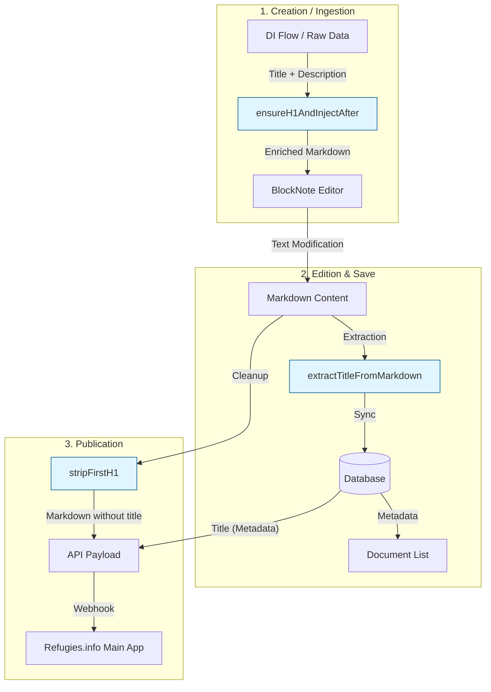

# H1 Title Handling Flow

This document explains how titles (H1) are handled within the Content Playground.

## 1. Context & UX Goal

We extract titles directly from the content to **centralize the User Experience (UX)**. Instead of asking the editorial team to fill out a separate "Title" field in a form AND write a title in the content, we offer a more **immersive experience**: the title is simply the first line of the document (H1) in the editor. This "What You See Is What You Get" approach reduces friction and simulates the final rendering on the platform.

## 2. Why? (The Problem)

However, managing titles this way is technically complex because the title exists in two places:
1.  **In metadata** (database, for display in lists).
2.  **In content** (the `# My Title` text at the top of the Markdown file).

If these two sources are not perfectly synchronized, we risk:
-   **Duplicates**: The title appears twice on the site (once via the title component, once via the Markdown content).
-   **Inconsistencies**: The user edits the title in the editor, but the document list still displays the old title.
-   **Display bugs**: Using regular expressions ("regex") to find `# Title` is fragile. For example, a script containing `# comment` inside a code block could be mistaken for a title.

**The Solution**: A centralized and "intelligent" logic that understands the Markdown structure (via AST) to read, clean, and inject titles without errors.

## 2. How? (The Solution)

We use a **centralized approach**: all title manipulation logic resides in a single shared package (`@playground/shared-types`).

The lifecycle of a title follows these major steps:

1.  **Ingestion/Creation**: We ensure the raw content has an H1 so the editor can display it properly.
2.  **Modification (Editor)**: The user visually modifies the H1.
3.  **Save**: We extract the H1 from the content to update the database metadata.
4.  **Publication**: We strip the H1 from the Markdown content sent to the API, as the API expects the title in a separate field (to avoid duplication).

### Flow Visualization

## 3. Details (Technical Utilities)

All utilities use AST (**Abstract Syntax Tree**) via `unified` and `remark`. It's like parsing code: we don't just look at text, we understand its structure.

Location: `packages/shared/src/lib/markdown.ts`

| Utility | Role | Main Usage |
| :--- | :--- | :--- |
| **`ensureH1AndInjectAfter`** | **Preparation**. Checks if an H1 exists. If not, creates one via metadata. Can also inject a description after the title. | Preparing content for the Editor during DI import. |
| **`extractTitleFromMarkdown`** | **Synchronization**. Reads Markdown, finds the first H1 (or frontmatter), and returns clean text. | Updating the title in the database on every save. |
| **`stripFirstH1`** | **Cleanup**. Physically removes the first H1 node from the Markdown file. | Building the JSON payload for the Refugies.info API (which adds the title itself). |
| **`hasH1`** | **Validation**. Returns `true` if an H1 exists. | Checking before save that the user hasn't deleted the title. |

### Database Note

A dedicated SQL view (`workflow_ingestion_metadata`) automatically calculates the title to display in lists by taking the first available title based on priority:
1.  Manual edition (`editorial_records.metadata.title`)
2.  Original data (`ingestion_records.metadata.title`)
3.  Fallback ("Untitled")

This ensures the interface remains fast without having to re-calculate the title from Markdown on every render.
