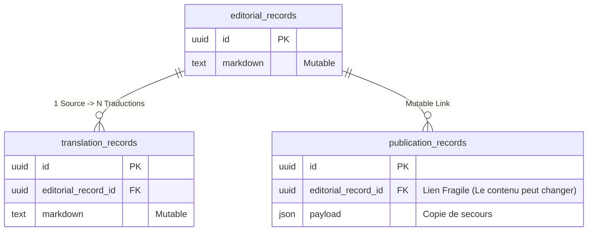
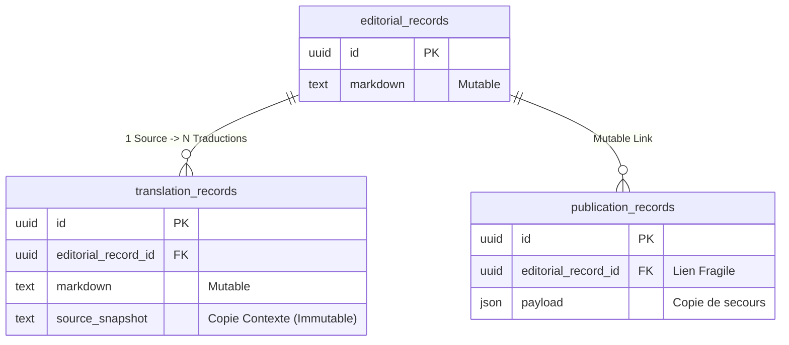
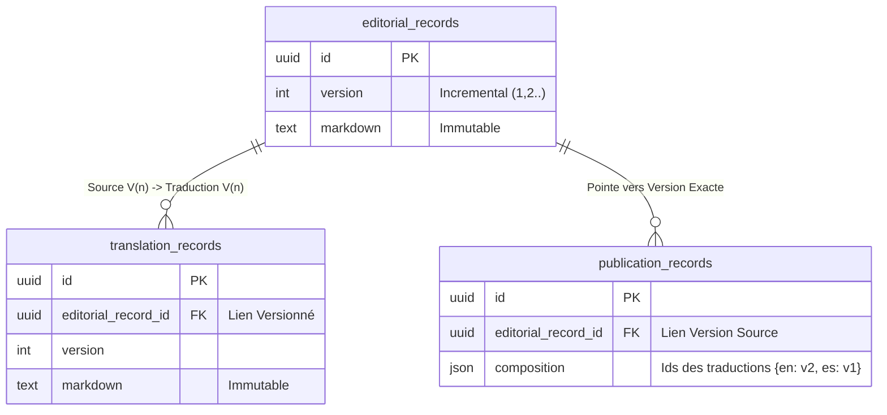

# Architecture & Décision : Base de Données Traduction

**Date** : 26 Janvier 2026
**Public** : Product Owners & Tech Team
**Sujet** : Choix de l'architecture pour le support "Human in the Loop" (8 langues) et l'historique des modifications.

## Enjeux Produit
1.  **Synchronisation** : Garantir que le traducteur travaille sur la bonne version du texte Français.
2.  **Auditabilité** : Savoir qui a modifié quoi et quand (traçabilité des actions éditoriales et IAM).
3.  **Flexibilité** : Permettre des allers-retours (Draft <-> Published) sans perdre de données.

---

## Comparatif des Solutions

### Solution 1 : "Mutating Records" (CRUD Standard)
*L'approche classique : une seule version "live". Chaque sauvegarde écrase la précédente.*

**Concept Métier** :
On gère l'état instantané. Il n'y a pas de mémoire du passé. Si une erreur est commise, la donnée précédente est perdue.

**Schéma Technique** :

**Analyse** :
*   **Difficulté Dev** : 🟢 **1/5** (Très simple)
*   **Impact Produit** :
    *   ✅ **Possible** : Mise en production très rapide.
    *   ❌ **Impossible** : 
        *   "Rollback" (Annuler une modification).
        *   Afficher un "Diff" fiable au traducteur (Qu'est-ce qui a changé depuis ma dernière visite ?).
        *   Audit légal (Prouver le contenu d'une fiche à une date T).
    *   ❓ **Comment savoir ce qui est en ligne ?**
        *   On regarde le record. Mais attention : si on l'a modifié depuis la publication (Draft), ce qu'on voit en base **n'est pas** ce qui est en ligne. On ne sait donc pas vraiment ce qui est publié sauf si on stocke une autre copie ailleurs (ex: payload JSON dans `publication_records`).
    *   👤 **Attribution (Qui a fait quoi ?)**
        *   On ne connaît que le **dernier** éditeur (`updated_by`). Si Alice modifie, puis Bob modifie, on perd la trace d'Alice.

**Score ACID ** :
| Propriété | Score | Détail |
| :--- | :--- | :--- |
| **Atomicity** | 🟡 Moyen | Risque de modifier le FR sans invalider les traductions dans la même transaction. |
| **Consistency** | 🔴 Faible | Les traductions peuvent désynchroniser silencieusement du source. |
| **Isolation** | 🔴 Faible | "Save as you type" modifie la Prod. Dirty Reads possibles. |
| **Durability** | 🔴 Faible | L'historique est écrasé. Perte de données par design. |

---

### Solution 2 : "Milestone Snapshots" (Historique Partiel)
*On conserve la version "live" uniquement, mais on gèle une copie du contexte au moment de l'action.*

**Concept Métier** :
On reste sur un fonctionnement simple, mais on ajoute une "mémoire tampon" dans la traduction pour savoir sur quel texte français elle s'est basée.

**Schéma Technique** :

**Analyse** :
*   **Difficulté Dev** : 🟢 **2/5** (Simple)
*   **Impact Produit** :
    *   ✅ **Possible** : Afficher un comparatif (Diff) entre le Français Actuel et le Français "au moment de la traduction".
    *   ❌ **Impossible** : Explorer l'historique complet des modifications. Si on modifie 10 fois le français, on ne garde que la dernière version et le snapshot lié à la traduction.
    *   ❓ **Comment savoir ce qui est en ligne ?**
        *   Même problème que la Solution 1. On doit se fier à un log externe. Le lien entre "Ce Log" et "L'état actuel de la base" est fragile car la base a pu bouger entre temps.
    *   👤 **Attribution (Qui a fait quoi ?)**
        *   Comme la Solution 1 : on ne connaît que le dernier intervenant sur la version active.

**Score ACID ** :
| Propriété | Score | Détail |
| :--- | :--- | :--- |
| **Atomicity** | 🟡 Moyen | Transaction simple. |
| **Consistency** | 🟢 Fort | Cohérence forte entre Traduction et Snapshot. |
| **Isolation** | 🔴 Faible | Toujours mutable. |
| **Durability** | 🟡 Moyen | Trace contextuelle conservée, mais pas d'audit complet transactionnel. |

---

---

### Solution 3 : "Fully Immutable" (Versioning Complet) - 🏆 Recommandation
*Chaque sauvegarde crée une nouvelle version. Rien n'est jamais écrasé.*

**Concept Métier** :
Le principe du "Livre de Bord". On trace chaque étape. Une traduction est explicitement liée à une version précise (V1, V2...) du texte source. C'est l'architecture utilisée par Git, les Wikis, et les outils comptables.

**Schéma Technique** :

**Analyse** :
*   **Difficulté Dev** : 🟡 **3/5** (Modéré)
*   **Impact Produit** :
    *   ✅ **Possible** : 
        *   **Audit Total** : Rejouer l'histoire de la fiche.
        *   **Sync Parfaite** : Détection mathématique de l'obsolescence (Si Source ID != Traduction Source Link -> Obsolète).
        *   **Rollback** : Revenir n'importe quand à une version précédente.
    *   ❌ **Contraintes** :
        *   Volume de données plus important (mais négligeable pour du texte en 2026).
    *   ❓ **Comment savoir ce qui est en ligne ?**
        *   **Logique "Event Log" + "Snapshot"** :
        *   Chaque action (ex: "Publier Traduction EN") crée une ligne dans `publication_records`.
        *   Cette ligne pointe vers l'élément modifié (Delta) **ET** stocke l'état complet à cet instant (Snapshot JSON).
        *   Pour le dev : On lit le dernier record => On a tout.
        *   Pour l'audit : On a la liste chronologique précise des actions.
    *   👤 **Attribution (Qui a fait quoi ?)**
        *   **Parfaite**. Chaque version (`editorial_record` ou `translation_record`) a son champ `author_id`.
        *   On distingue même **L'Editeur** (celui qui a écrit le draft) du **Publicateur** (celui qui a validé la mise en ligne, via `publication_records.published_by`).
        *   Ex: "Bob a écrit la V2, Alice a publié la V2". Totalement transparent.

**Score ACID ** :
| Propriété | Score | Détail |
| :--- | :--- | :--- |
| **Atomicity** | 🟢 Excellent | Chaque version est un "commit" insert-only. |
| **Consistency** | 🟢 Excellent | Impossible d'avoir une traduction orpheline ou ambiguë. Le lien est gravé dans le marbre. |
| **Isolation** | 🟢 Excellent | Les lecteurs lisent la V1 pendant qu'on rédige la V2 (MVCC naturel). |
| **Durability** | 🟢 Excellent | Rien n'est jamais supprimé. Log complet. |

---

## Conclusion

La **Solution 3 (Fully Immutable)** est la meilleure à notre point de vue.

Elle offre le meilleur ROI (Retour sur Investissement) :
- Un coût de développement modéré (+1 point vs Snapshot).
- Une couverture fonctionnelle maximale pour l'avenir (Audit, Rollback, Sync).
- Une robustesse structurelle qui évite les bugs de synchronisation ("Pourquoi ma traduction ne correspond pas au texte ?").
