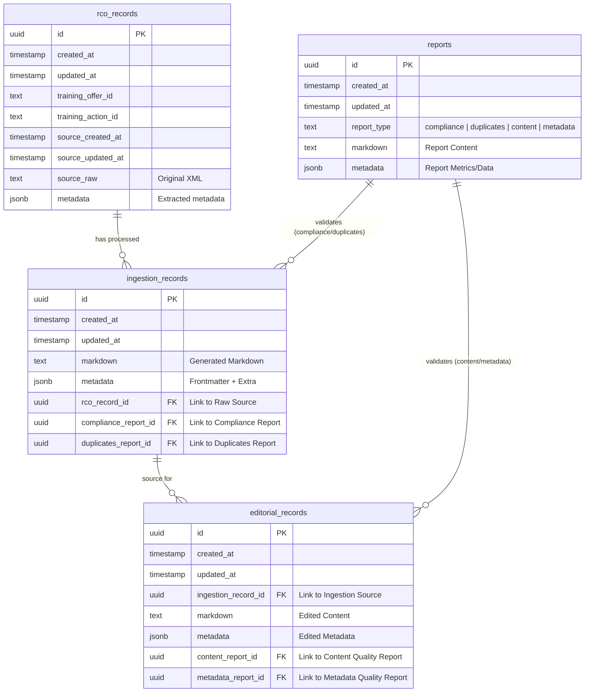

# Database Schema Documentation

This document describes the current database schema for the Content Playground, specifically consolidated around the ingestion and editorial workflow.

## Overview

The database is structured to support a 3-step processing workflow:
1.  **Raw RCO Data**: Storing the original XML from the source.
2.  **Ingestion**: Processing raw data into Markdown and generating initial reports.
3.  **Editorial**: Storing the refined content ready for publication.

## Entity Relationship Diagram

## Table Definitions

### `rco_records`
Stores the raw data received from the RCO (Reseau Carif-Oref) XML feed. This table acts as the immutable source of truth for incoming data.

### `ingestion_records`
Represents the result of the initial processing of an `rco_record`. It contains the converted Markdown and links to automated quality reports (`reports`) generated during ingestion.

-   **Foreign Keys**:
    -   `rco_record_id`: References `rco_records(id)`.
    -   `compliance_report_id`: References `reports(id)`.
    -   `duplicates_report_id`: References `reports(id)`.

### `editorial_records`
Stores the user-refined or "Golden" copy of the content. This is the version intended for final publication or export.

-   **Foreign Keys**:
    -   `ingestion_record_id`: References `ingestion_records(id)`.
    -   `content_report_id`: References `reports(id)`.
    -   `metadata_report_id`: References `reports(id)`.

### `reports`
A consolidated table for storing all types of analysis reports generated by agents or system checks.

-   **Columns**:
    -   `report_type`: Classifies the report (e.g., 'compliance', 'duplicates').
    -   `markdown`: The human-readable body of the report.
    -   `metadata`: Structured data/metrics associated with the report.
