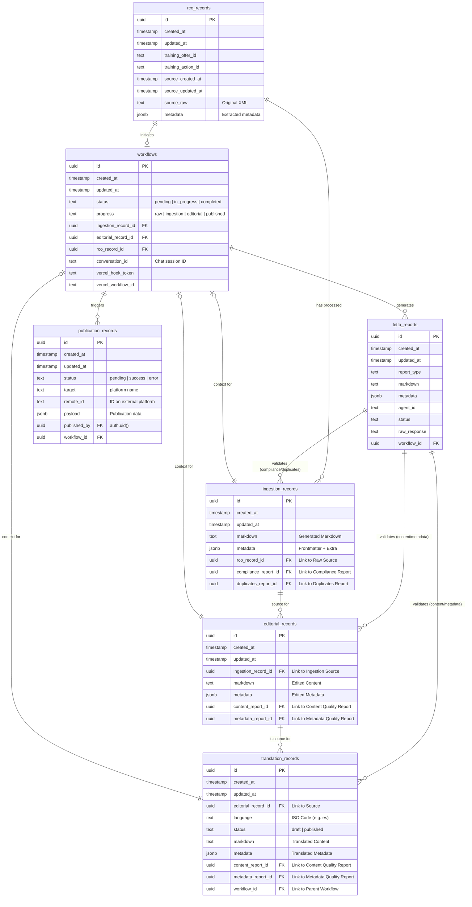

# Database Schema Documentation

This document describes the current database schema for the Content Playground, specifically consolidated around the ingestion and editorial workflow.

## Overview

The database is structured to support a 3-step processing workflow:
1.  **Raw RCO Data**: Storing the original XML from the source.
2.  **Ingestion**: Processing raw data into Markdown and generating initial reports.
3.  **Editorial**: Storing the refined content ready for publication.

It also tracks the flow execution through:
-   **Content Flows**: Tracks the lifecycle and status of a piece of content.
-   **Vercel Workflows**: Links the content flow to the Vercel Workflow engine execution execution.

## Entity Relationship Diagram

## Table Definitions

### `rco_records`
Stores the raw data received from the RCO (Reseau Carif-Oref) XML feed. This table acts as the immutable source of truth for incoming data.

### `ingestion_records`
Represents the result of the initial processing of an `rco_record`. It contains the converted Markdown and links to automated quality reports (`letta_reports`) generated during ingestion.

-   **Foreign Keys**:
    -   `rco_record_id`: References `rco_records(id)`.
    -   `compliance_report_id`: References `letta_reports(id)`.
    -   `duplicates_report_id`: References `letta_reports(id)`.

### `editorial_records`
Stores the user-refined or "Golden" copy of the content. This is the version intended for final publication or export.

-   **Foreign Keys**:
    -   `ingestion_record_id`: References `ingestion_records(id)`.
    -   `content_report_id`: References `letta_reports(id)`.
    -   `metadata_report_id`: References `letta_reports(id)`.

### `translation_records`
Stores the translated version of an `editorial_record`. It follows the same schema as the editorial record to ensure consistency.

-   **Foreign Keys**:
    -   `editorial_record_id`: References `editorial_records(id)`.
    -   `content_report_id`: References `letta_reports(id)`.
    -   `metadata_report_id`: References `letta_reports(id)`.
    -   `workflow_id`: References `workflows(id)`.

### `publication_records`
Tracks the history of publications to various platforms. Linked to the workflow that triggered the publication.

-   **Foreign Keys**:
    -   `workflow_id`: References `workflows(id)`.
    -   `published_by`: References `auth.users(id)`.

### `letta_reports`
A consolidated table for storing all types of analysis reports generated by agents or system checks.

-   **Columns**:
    -   `report_type`: Classifies the report (e.g., 'compliance', 'duplicates').
    -   `markdown`: The human-readable body of the report.
    -   `metadata`: Structured data/metrics associated with the report.
    -   `agent_id`: The ID of the Letta agent that generated the report.
    -   `status`: Report completion status ('complete' or 'incomplete').
    -   `raw_response`: Raw agent response text when status is incomplete, for debugging.

### `workflows`
The central nervous system of the application. Tracks the entire lifecycle of a content piece, from raw RCO data to publication. It consolidates the previous `content_flows` and `vercel_workflows` concepts.

-   **Columns**:
    -   `status`: High-level status (pending, in_progress, completed).
    -   `progress`: Granular stage (raw, ingestion, editorial, etc.).
    -   `conversation_id`: ID of the chat session associated with this workflow.
    -   `vercel_workflow_id`: ID of the external Vercel Workflow run.
    -   `vercel_hook_token`: Token for secure webhooks.

-   **Foreign Keys**:
    -   `rco_record_id`: References `rco_records(id)`.
    -   `ingestion_record_id`: References `ingestion_records(id)`.
    -   `editorial_record_id`: References `editorial_records(id)`.
